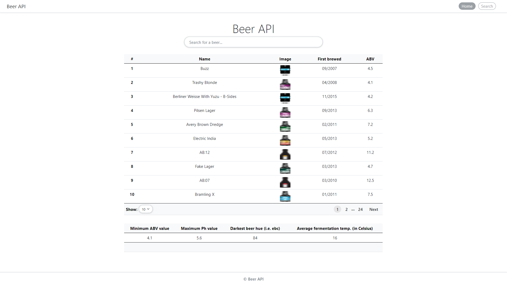

# 
# Beer_API
<table>
<tr>
<td>
  A webapp using Quandl API to display history of stock growth in a given period of time. It helps predict the growth of stocks from the  charts of stock performace in any period of time. It helps to judge stocks, with the principle of momentum investing, which returns 1% per month on average.
</td>
</tr>
</table>

