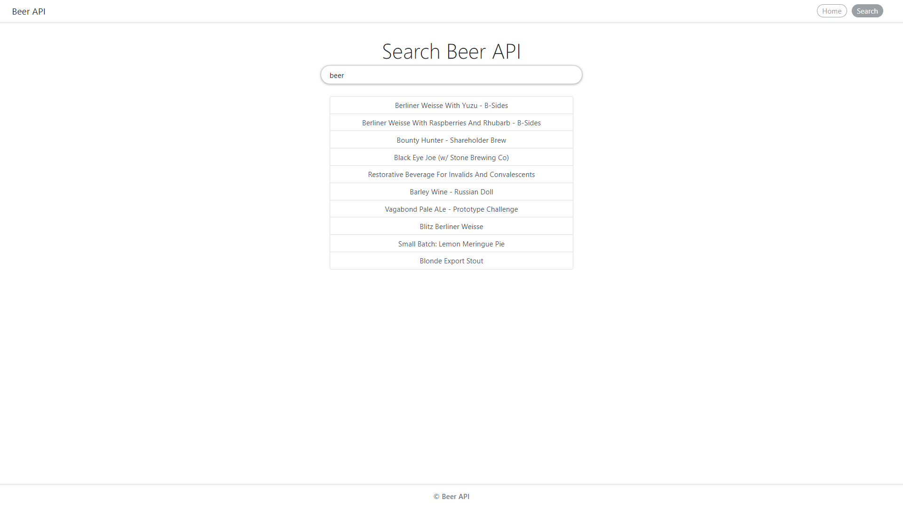
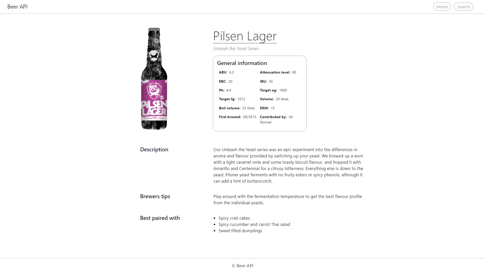

# 
# Beer_API
<table>
<tr>
<td>
  A webapp that uses the Punk API to display various beer related data, in tabular fashion or individually, according to the requested parameters. The primary purpose of this webapp is to help beer enthusiasts discover new and exotic beer flavours. Users can browse through the vast catalogue of the Punk API, in tabular format, or go into more detail about individual beers, with the help of the search functionality.
</td>
</tr>
</table>

## Tech / Frameworks used 

- JavaScript
- CSS
- Bootstrap

## API Reference
[Punk API V2](https://punkapi.com/documentation/v2) 

## Installation
If you wish to test the App, or fix a bug or enhance an existing module, follow these steps:

- Fork / Clone the repo
- Create a new branch (`git checkout -b improve-feature`)
- Make the appropriate changes in the files
- Add changes to reflect the changes made
- Commit your changes (`git commit -am 'Improve feature'`)
- Push to the branch (`git push origin improve-feature`)
- Create a Pull Request 

## Site

### Landing Page

### Search Page

### Beer page

